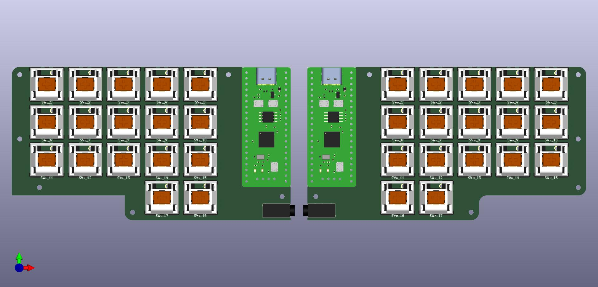
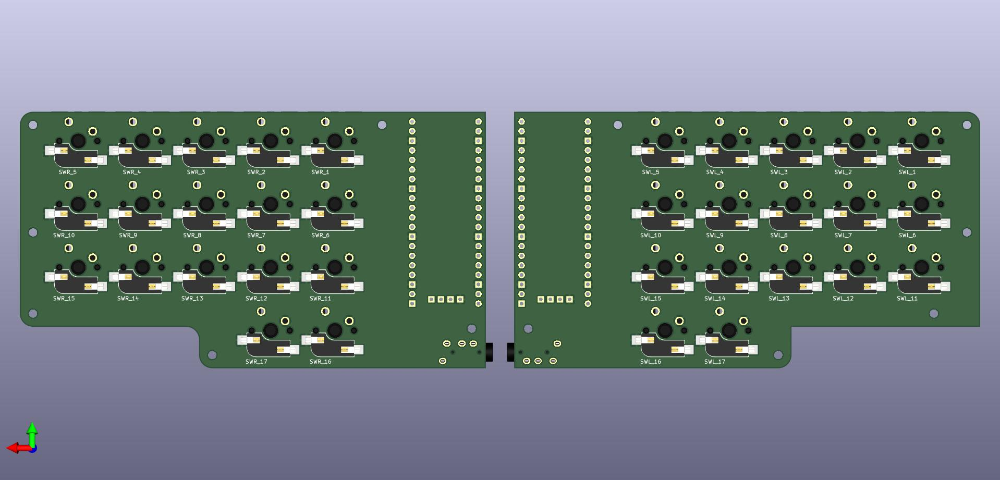

# Ursa

This is a split keyboard with 34~36 keys only.

# Render

Current status of the Render looks like as below:

## Credits

Kailh Socket 3D Model was obtained from [_QMK_](https://github.com/qmk). All credits go to them. The exact file can be found [here](https://github.com/qmk/qmk_hardware/blob/master/components/kailh_socket_mx.stp).
